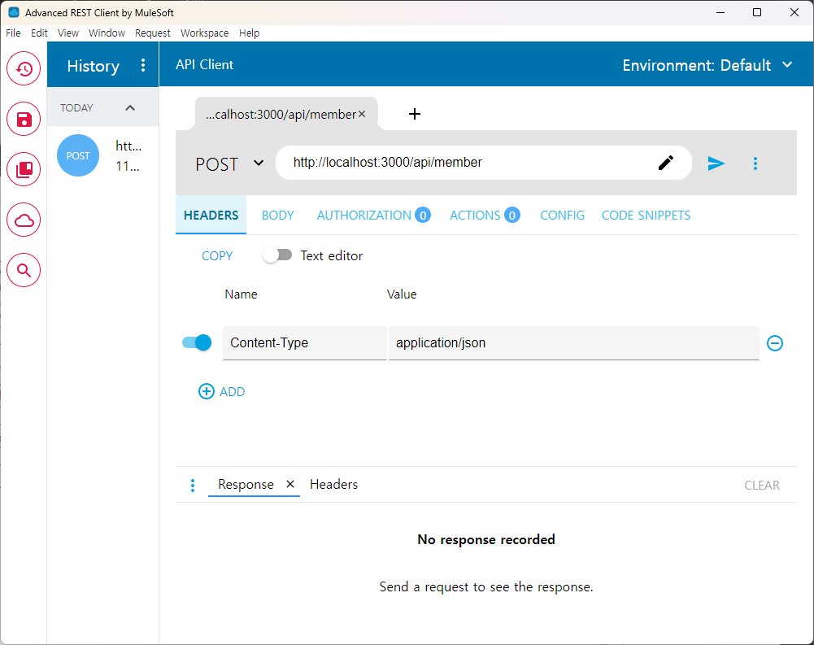
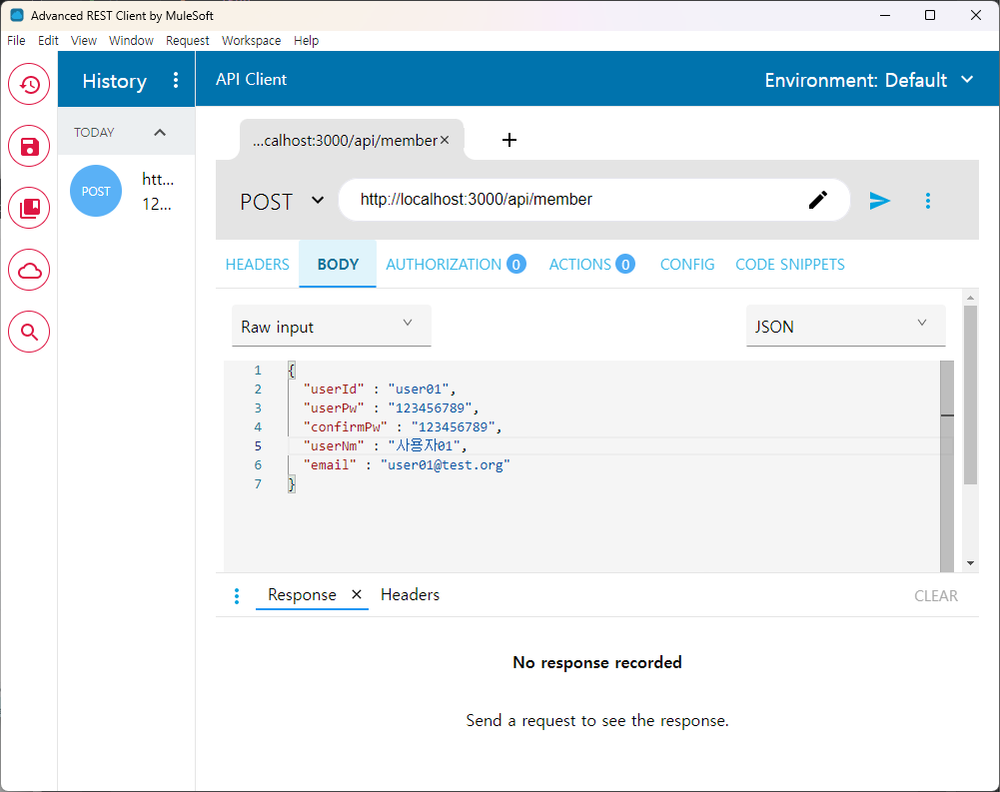

JSON 응답과 요청 처리

1. JSON 개요
- REST API(Application Programming Interface)
  - REST(Representational State Transfer)의 약자
    - 자원을 이름으로 구분하여 해당 자원의 상태를 주고받는 모든 것을 의미합니다. (상태를 표현한 방법으로 전송 요청하는 방식)    
    - HTTP URI(Uniform Fesource Identifier)를 통해 자원(Resource)을 명시하고,
    - HTTP Method(POST, GET, PUT, DELETE, PATCH 등)를 통해
    - 해당 자원(URI)에 대한 CRUD Operation을 적용하는 것을 의미합니다.

- 데이터 공유를 위한 통일 형식 중 하나
- JSON(JavaScript Object Notation) : 자바스크립트 객체 표기법(문자열)
```json
  {
      "이름" : "값",
      "이름" : "값"
      ...
}

```

2. Jackson 의존 설정
   1) jackson-databind
   2) jackson-data-type-jsr-310 : Java Date & Time API,

3. **@RestController로 JSON 형식 응답**
    - Rest
    - 응답 : JSON 문자열 : 객체 반환 : getter를 통해서 자동 완성
    -         문자열 
    -         응답 Body 없는 형태(void)

   1) @RestController
      반환값 객체 : JSON 으로 변환

      요청
      - 기본 요청 body데이터 형식
      content-type: application/x-www-form-urlencoded
      이름=값&이름&값

          -  데이터 형식이 JSON : content-type: application/json
          - 커맨드 객체 앞에 @RequestBody를 추가 : Body 데이터 형식 JSON으로 인식 -> 변환
   	
          - ARC(Advanced Rest Client)

       - 스프링5에서 추가된 기능

   2) @ResponseBody
       - 특정 요청 메서드를 Rest 요청으로 사용

   3) @Jsonlgnore
      - JSON 문자열 변환 배제

   4) @JsonFormat
      - 날짜 형식화

참고)
- @Log
- @Log4J
- @Slf4j
  - log 변수 생성
    - trace
    - debug
    - info
    - warn
    - error


4. @RequestBody JSON 요청 처리


- application/json 형식의 요청 데이터 변환
```json
    {
        "키" = "값"
        "키" = "값"
    }
```
- 참고)
  - 기본 형식
    - application/x-www-form-urlencoded
      - 키=값&키=값
5. JSON 데이터의 날짜 형식 다루기
1) @JsonFormat

2) 요청 객체 검증하기
- 정상 응답도 JSON, 오류 응답 JSON

5. ResponseEntity를 이용한 응답 데이터 처리
- 응답 코드(헤더), 응답 바디(body) 상세하게 설정

1) status(int status) : 응답 코드
2) body(T t) : 응답 BODY 데이터
3) build() : 응답 BODY 데이터가 없는 경우


4) noContent() 204
5) badRequest() 400
6) notFound() 404
7) ok(), ok(T body) 200
8) created(Uri location) / 201 + 응답 헤더 Location: 주소

에러 메세지
- 어떤 페이지 : message : 에러메세지
- 다른 페이지 : memo : 에러메세지


참고)
201 : CREATED
200
400
401
404
500

통일성 있는 형식

6. @ExceptionHandler
- 특정 예외가 발생하면 유입되는 메서드
- 예외 클래스
- Model
- HttpServletRequest
- HttpServletResponse
- HttpSession

- 응답 방식 JSON, 문자열, void


@RestControllerAdvice


스프링 부트 : 에러페이지
템플릿 경로
/error/
400.html
401.html
403.html
404.html
500.html

		오류페이지의 내장 변수 
		message
		path
		timestamp
		status : 상태 코드 
		error

