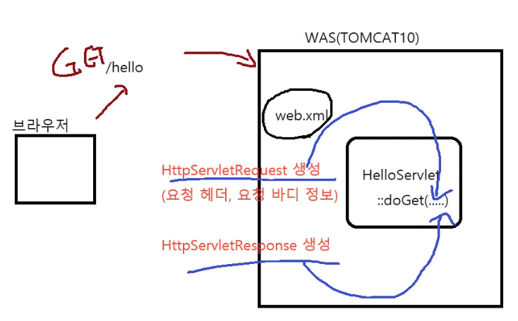

extends HttpServlet 를 상속받으면 servlet 클래스가 된다.

등록 설정 파일 : webapp - WEB-INF - web.xml : 해당하는 이름을 가지고 클래스가 객체가 되어있으면 요청 메소드 실행

doGet(HttpServletRequest req, HttpServletResponse resp)
: 요청이 들어오면 들어간다. 요청헤더와 요청 바디정보를 가지고 req 객체를 만들어준다.<br>
요청이 들어오면 응답 resp를 서버에서 만든다.

get은 주로 검색의 용도
요청을 하면 서버에 도달 - web.xml 파일에 정의 된 주소를 보고 - 각각에 서블릿 객체를 찾는다. - 요청방식에 따라 get이면 doGet을 호출<br>
호출할때 : 요청과 응답에 대한 객체를 요청 헤더와 요청 바디에 대한 정보를 가지고 만들어준다.<br>
이 목적은 응답하는것이다. response 객체도 TOMCAT 서버가 만들어서 호출할때 매개변수로 투입해서 실행한다.<br>
구현 클래스는 TOMCAT 서버가 되어있다. 우리는 API만 알고 있으면 된다.

HttpServletRequest : 요청 헤더와 요청 바디에 대한 정보<br> 
HttpServletResponse : 응답 헤더를 추가 하거나 출력

매서드 재정의 불러오기 : ctrl + O, 마우스 오른쪽 키 - Generate - Override Methods - doGet, doPost

JSP
스크립트 태그

1) 스크립틀릿 태그 : 지역변수
   <%
   자바코드 ..
   %>

2) 선언문 : 맴버변수
   <%!
   자바코드
   %>

3) 표현문 태그
   <%= 변수 %>


<%@include file="파일 경로" %>

-> _jspServlet 메서드 내부
out.write(변수);

버퍼 통제 기능
웹페이지는 버퍼에 담고 꽉 차면 출력

<jsp:forward page="경로" />
기존 버퍼 취소 - forward에 써있는거만 출력 (밑에도 출력x)

<jsp:include page="경로" />
버퍼를 담아서 같이 포함, 기존거 취소 x

RequestDispatcher 인터페이스
forward
include

M (Model) : 기능 (Service) - 다른 객체의 유기적 협동 -> 기능 완성
DTO(Data Transfer Object) : 데이터 전달용 객체
Validator : 유효성 검사
DAO(Data Access Object) : 데이터 접근 객체
V (View) : 응답 출력
JSP
C (Controller) : 요청 응답의 중재자 -> 서블릿


암기!
JSP 내장객체 - _jspService 지역변수
- request, response, pageContext, config, out, application, session

1) HttpServletRequest request
2) HttpServletResponse response
3) PageContext pageContext :jsp 환경에 대한 객체
4) HttpSession session
5) ServletContext application : 지역변수
6) ServletConfig config : web.xml에 init-Param 설정
7) JspWriter out
8) Object page = this
9) Throwable exception : Page 디렉티브 isErrorPage="true"


암기!
속성(데이터)을 관리하는 4가지 객체

PageContext pageContext : JSP 페이지 내에서 유지되는 데이터 설정<br>
HttpServletRequest request : 요청이 처리되는 동안 유지되는 데이터<br>
HttpSession session : 세션이 유지되는 동안 데이터<br>
ServletContext application : 애플리케이션이 실행되는 동안 유지되는 데이터<br>

void setAttribute(String name, Object value); : 속성을 추가, 변경 // name은 vlaue를 찾기위한 이름, object 다 가능<br>
Object getAttribute(String name) : 속성 조회<br>
void removeAttribute(String name) : 속성 제거

데이터 유지 범위
pagContext < request < session < application

EL식 적용 우선 순위
pageContext > request >session > application


WEB-INF의 하위 폴더에 넣으면 뷰형태로 직접 접근 못하게 막는다, jsp로는 접근 못한다.

# 필터와 래퍼

- 요청과 응답 사이에서 걸러주는 기능
- 요청과 응답의 공통된 부분을 처리할 때

1. 필터 클래스, 필터 객체, 필터
   Filter 인터페이스를 구현 -> 필터 클래스

2. 필터가 위치하는 곳

3. 필터 클래스의 작성, 설치, 등록
   web.xml
```xml
<filter>
    <filter-name>..</filter-name>
    <filter-class>...</filter-class>
</filter>
<filter-mapping>
    <filter-name>...</filter-name>
    <url-pattern>...</url-pattern>
</filter-mapping>

```

   - 필터 체인(filter chain)

4. 필터 클래스의 init 메서드와 destroy 메서드
5. 래퍼 클래스 작성 및 적용하기

웹 컴포넌트(doGet 실행)
