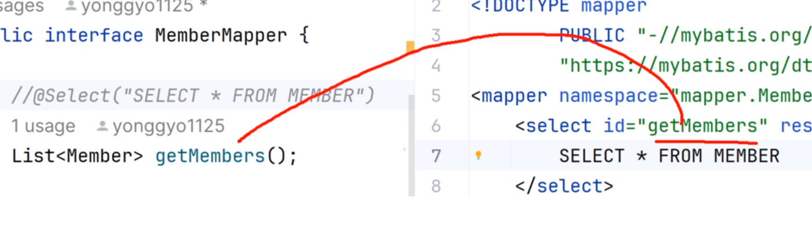

JDBC와 커넥션 풀 설정

1. JDBC 연결
2. JDBC 테스트 코드
3. 커넥션 풀 설정

MyBatis와 스프링 연동

1. MyBatis
- MyBatis는 흔히 SQL 매핑(mapping) 프레임워크로 분류
- 개발자들은 JDBC 코드의 복잡하고 지루한 작업을 피하는 용도로 많이 사용합니다.
- 전통적인 JDBC 프로그래밍의 구조와 비교해 보면 MyBatis의 장점을 파악할 수 있습니다.
- MyBatis는 기존의 SQL을 그대로 활용할 수 있다는 장접이 있고, 진입 장벽이 낮은 편이어서 JDBC의 대안으로 많이 사용합니다.
- 스프링 프레임워크의 특징 중 하나는 다른 프레임워크를 배척하는 대신에 다른 프레임워크들과의 연동을 쉽게 하는 추가적인 라이브러리들이 많다는 것입니다.
- MyBatis 역시 mybatis-spring이라는 라이브러리를 통해서 쉽게 연동작업을 처리할 수 있습니다.

2. MyBatis 관련 라이브러리 추가
- spring-jdbc/spring-tx
- mybatis/mybatis-spring

3. SQLSessionFactory
- MyBatis에서 가장 핵심적인 객체는 SqlSession이라는 존재와 SqlSessionFactory 입니다.
- SqlSessionFactory의 이름에서 보듯이 내부적으로 SqlSession이라는 것을 만들어내는 존재
- 개발에서는 SqlSession을 통해서 Connection을 생성하거나 원하는 SQL을 전달하고, 결과를 리턴 받는 구조로 작성하게 됩니다.
- 스프링에 SqlSessionFactory를 등록하는 작업은 SqlSessionFactoryBean을 이용합니다.
    - DataSource 빈과 설정을 통합

- 패키지명을 보면 MyBatis의 패키지가 아니라 스프링과 연동 작업을 처리하는 mybatis-spring라이브러리의 클래스임을 알 수 있습니다.


    @Bean
    public SqlSessionFactory sqlSessionFactory() throws Exception {
        SqlSessionFactoryBean sqlSessionFactoryBean = new SqlSessionFactoryBean();
        sqlSessionFactoryBean.setDataSource(dataSource());
        return sqlSessionFactoryBean.getObject();
    }

4. 스프링과의 연동 처리
1) Mapper 인터페이스
2) Mapper 설정 - @MapperScan
3) Mapper 테스트
4) XML 매퍼와 함께 사용
```xml
   <mapper>
   <select>조회 쿼리</select>
   <insert>추가 쿼리</insert>
   <update>수정 쿼리</update>
   <delete>삭제 쿼리</delete>
   </mapper>
```

<br>
xml파일에서 동일한 명칭의 ID값을 찾아 매칭
 

5. slf4j 설정
1) 의존성 추가
    - slf4j-api, logback-classic

2) 로거 설정하기

wrapper.xml : 복잡한 쿼리에 사용<br>
interface : 간단한 쿼리에 사용