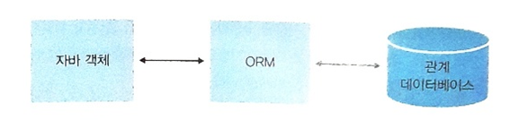
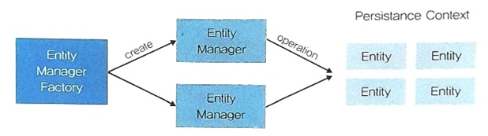

# Spring Data JPA

1. JPA 동작 방식
0) ORM : 객체 <- 번역(ORM) -> DB
- DB에 맞는 쿼리 해석

1) JPA란?
- JPA (Java Persistence API) : ORM 표준 (Object Relational Mapping)
- Hibernate Entity Manager

- 자바 영속성 API
- 영속성 : 상태 변화 감지 메모리 (Persistence Context)
	: 데이터 값이 변경 : UPDATE 쿼리
	: 없는 데이터를 추가한 엔티티 : INSERT 쿼리
	: 데이터 제거 : DELETE 쿼리

동일한 코드 -> 드라이버 변경 -> 플랫폼에 맞는 쿼리 실행

EntityManagerFactory
	-> EntityManager : 엔티티 영속성 관리

2) JPA 동작 방식
	- 엔티티 : 엔티티 클래스의 정의 : 테이블의 정의
	            : 각각의 엔티티는 데이터 하나 하나

	- 엔티티 매니저 팩토리
	- 엔티티 매니저
		1) find() : 조회, 기본키로 조회, 이미 영속성에 엔티티가 있으면 DB에서 조회 X - 1차 캐시, 성능상 이점
		2) persist() : 영속성 컨텍스트에 엔티티를 영속  : 상태 감지 시작
		3) remove() : 영속성 상태 -> 제거 상태 : DELETE
		4) flush() : DB 반영
				참고)
					find(..) 조회 메서드 호출시 flush()가 먼저 진행 되고 -> 조회
		5) detach() : 영속성 분리 : 상태감지 X
		6) clear() : 영속성 전체 제거
		6) merge() : 분리된 영속성 -> 영속 상태  : 상태 감지 O

	- EntityManagerFactory
	- EntityManager : 엔티티의 영속성 관리

3) 영속성 컨텍스트 사용 시 이점
4) 영속성 컨텍스트
5) 엔티티의 생명주기

- 1차 캐시
- 동일성 보장
- 영속성 컨텍스트 쓰기 지연 SQL 저장소
- 트랜잭션을 지원하는 쓰기 지연

7) 설정하기
	- DDL_AUTO
		none : 아무런 변경 X
		create : 애플리케이션 시작시에 기존 테이블 DROP, 새로 생성
		create-drop : 애플리케이션 시작시에 기존 테이블 DROP, 새로 생성, 종료시에도 DROP
		update : 기존 테이블 DROP X, 변경 사항만 반영(제거  X)
		validate : 기존 테이블 DROP X, 변경 사항 체크(변경 사항이 있으면 예외 발생)

		개발시 : create, update
		배포 서버 : none, validate

2. Entity 설계하기

1) 엔티티 매핑 관련 애노테이션
- @Entity :
	엔티티명 : 기본값 : 클래스명
	참고) JPQL(Java Persistence Query Language)
	- name, value  - 엔티티 명을 직접 설정
- @Table
	- name : 테이블 명
		: 엔티티 명 == 테이블명

- @Temporal
	- Date, Calendar 클래스 관련 : 날짜, 시간, 날짜 + 시간

	- java.time API  사용시 필요 X
		LocalDate, LocalTime, LocalDateTime
- @CreatedDate, @LastModifiedDate
	: 엔티티 변화 감지를 통해서 변경(DB와 상관 X)
	: 변화 감지를 위한 이벤트 리스너

2) 공통 속성화
	@MappedSuperclass : 공통 속성화를 위한 상위 클래스

3) @IdClass
	: 기본키를 여러 컬럼을 조합해서 생성

	: 게시글 조회수 - UV
		브라우저 정보(User-Agent) + IP + 회원번호(0)  : UID  + 게시글 번호(ID)
	

