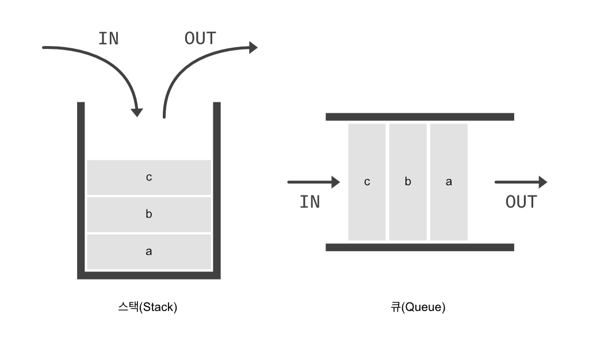

# 객체지향 프로그래밍
'어떤 대상(객체)'을 가지고 프로그래밍한다는 것

### 객체?
- object -> 사물, 대상
- 자동차
  - 속성
    - 4개의 바퀴
    - 운전대
    - 연료
    - ... 자동차를 나타내는 속성들
  - 행위 : 구성하는 속성들을 가지고 움직인다.
    - 움직인다는 동작
- 사람
  - 속성
    - 이름
    - 성별
    - 키, 몸무게
    - 혈액형
  - 행위
    - 자동차를 움직인다.

**객체와 객체 사이에는 상호작용이 발생한다.**

개념에 대한 객체도 존재한다.
- 상품
  - 상품명
  - 상품가격
  - 재고
- 장바구니
- 주문(상품을 주문한다.)
  - 주문 번호
  - 고객 정보
  - 결제한다.

객체는 속성 + 행위로 구성되어있다.
- 다른 객체와 상호작용한다.

자바에서 속성은 어떤값, 변수이다.
- Car
  - long gasLevel
  - Wheel wheels
  - driving() { // }

동일한 여러 흰색 그랜저 차량을 만들기
- 자동차 공장 -> 자동자(객체)
- 설계도(class)
  - 구성요소에 대한 정의
  - 동작 방식
- 공정 로봇(new)

자바에서는 class를 통해 객체를 만든다.<br>
클래스는 각각의 속성과 행위를 정의한다.<br>
그러한 속성을 맴버 변수(인스턴스 변수)라고 한다. instance -> 실체<br>
메서드(함수) -> 행위 - 객체라고하는 참조자료형으로만 접근 가능한다. <br>
클래스를 통해 실체화 -> new

    (접근제어자) class 클래스 이름 {
    멤버변수(인스턴스 변수);
    메서드(함수);
    }


#### 절차 지향 프로그래밍
- 순서대로 일어나는 일을 시간순으로 프로그래밍 하는 것

##### 객체 지향 프로그래밍
- 객체를 정의하고 객체 간 협력을 프로그래밍 하는 것
- 객체를 먼저 정의하고 각 객체가 어떤 기능을 제공하고 객체 간 협력을 어떻게 구현할 것인지를 고민
- 클래스를 기반으로 프로그래밍 : 클래스는 객체의 속성과 기능을 코드로 구현한 것<br>
  
- 선언하여 클래스의 객체 속성을 나타내는 변수를 멤버변수라고 한다.
- 클래스에 선언하는 멤버변수는 다른말로 속성(property), 특성(attribute) 라고도 한다.

#### 변수의 자료형
<table>
    <tr>
        <th>기본 자료형</th>
        <th>참조 자료형</th>
    </tr>
    <tr>
        <td>int, long, float, double 등</td>
        <td>String, Date, Student 등</td>
    </tr>
</table>

## 메서드
함수(function)

 

매개변수
- 함수의 입력을 받는 변수를 매개변수
- 함수 내부에서 사용할 괄호 안의 변수를 매개변수

return 예약어
- '이 함수의 결과 값을 반환 합니다.'를 뜻하는 예약어가 return

반환형
- 반환 값의 자료형
- void는 비어있다는 의미로 '반환할 값이 없다'는 뜻
- 함수 수행을 종료하는 목적이므로 return 뒤에 반환값을 적지 않아도 된다.

함수 호출과 스택 메모리
- 함수를 호출하면 그 함수만을 위한 메모리 공간이 할당되는데, 이 메모리 공간을 스택(stack)이라고 부른다.
  
- A() -> B() -> C() 함수의 순서로 호출했다면 C() -> B() -> A() 순서로 반환되고 스택 메모리도 이 순서대로 소멸된다.
- 함수의 내부에서만 사용하는 변수를 지역변수라고 하고 지역변수는 스택메모리에서 생성된다.


클래스 기능을 구현하는 메서드
- 메서드(method)는 멤버변수를 사용하여 클래스의 기능을 구현한다.
- 즉, 메서드는 함수에 객체 지향개념이 포함된 용어로 이해하면 된다.
- 함수의 스택 메모리 사용방법과 함수의 장점등도 모두 메서드에 동일하게 적용된다.

#### 자바의 이름 짓기 규약
- 클래스 이름 : 파스칼 - 단어의 시작 문자는 모두 대문자 ex) OrderInfo, OrderItems
- 메서드 및 멤버변수 : 카멜 - 첫 단어를 제외 단어의 시작문자는 대문자 ex) showStudentInfo
- 패키지 이름 : 모두 소문자
- 상수명 : 모두 대문자, 단어와 단어사이는 언더바로 구분

## 클래스
- 프로그램을 시작하는 main() 함수
  - main() 함수는 자바 가상 머신(JVM)이 프로그램을 시작하기 위해 호출하는 함수이다.
  - 클래스 내부에 만들지만, 클래스의 메서드는 아니다.
- new 예약어로 클래스 생성하기
  - 클래스를 사용하려면 먼저 클래스를 생성해야 한다.

        클래스형 변수이름 = new 생성자;
  - 클래스가 생성된다는 것은 클래스를 실제 사용할 수 있도록 메모리 공간(힙 메모리)을 할당 받는다는 뜻이다.
  - 이렇게 실제로 사용할 수 있도록 생성된 클래스를 인스턴스라고 한다.
  - 그리고 인스턴스를 가리키는 클래스형 변수를 참조변수라고 한다.

## 인스턴스
<br>
- 클래스가 메모리 공간에 생성된 상태를 인스턴스라고 합니다.
- 또한 생성된 클래스의 인스턴스를 객체라고도 합니다.
- 클래스는 하나이지만, 이 클래스로부터 여려 개의 각기 다른 인스턴스를 생성할 수 있습니다.

      Student studentAhn = new Student();
      // studentAhn이라는 인스턴스 객체를 생성
- 인스턴스의 멤버변수 사용, 메서드 호출을 위해서는 마침표(.) 연산자 필요
- 객체명(참조변수).멤버변수 = 값;
- 객체명(참조변수).메서드(매개변수);

JVM - 자바 가상머신(Java Virtual Machine)
- .java -> 컴파일 -> class -> JVM이 이해할 수 있는 중간 언어 -> JVM(플랫폼에 맞게 제작된 프로그램) -> 바이트 코드 -> 실행
- 자바 모토 : write one, run every where

## 메모리
1. 데이터 영역 (정적 메모리 영역)
- 클래스 로더에 의해서 작성한 클래스 파일 = 재료
2. 스택 영역 (동적 메모리 영역)
- 함수가 실행(함수 호출)되는 메모리 영역
- 실행이 완료되면 메모리에서 제거
3. 힙 영역 (동적 메모리 영역)
- 객체가 생성되는 메모리 영역

#### 스택(stack)
- 쌓다.
- 가장 먼저 넣은 것을 가장 마지막에 꺼낼 수 있다.
- 가장 마지막에 넣은 것을 가장 처음으로 꺼낼 수 있는 구조
- LIFO(Last In First Out)

#### 큐(Queue)
- 대기하다
- 가장 먼저 넣은 것이 가장 먼저 실행
- 가장 마지막에 넣은 것이 가장 마지막에 실행
- FIFO (First In First Out)
- 선입선출



#### 힙(heap)
- 프로그램에서 사용하는 동적 메모리(dynamic memory) 공간
- 변수를 저장하는 공간 ex) StudentID, StudentName
- 객체가 생성될 때 사용하는 공간
- 클래스 생성자를 하나 호출하면 인스턴스가 힙 메모리에 생성된다.
- 힙은 동적으로 할당되며 사용이 끝나면 메모리를 해제해 주어야 한다.<br>
  
- 지역변수 studentAhn에 생성된 **인스턴스를 대입하는 것은 studentAhn에 인스턴스가 생성된 힙 메모리의 주소를 대입**한다는 것과 같은 의미입니다.
- 클래스가 생성될 때마다 인스턴스는 다른 메모리 공간을 차지한다.
  멤버변수를 저장하는 공간이 매번 따로 생긴다는 의미
- 이런 이유 때문에 클래스에 선언한 멤버변수를 다른말로 인스턴스 변수라고 합니다.

### 참조변수와 참조 값
- 주소를 가지고 다른 위치(메모리)에 있는 자원(객체)를 접근하는 것
- 참조 변수는 힙 메모리에 생성된 인스턴스
- 힙 메모리에 생성된 인스턴스의 메모리 주소는 참조 변수에 저장
- 참조 변수 - 인스턴스의 주소 값
- 참조 변수에 들어가는 내용 : 클래스 이름@주소 값
- 주소 값은 다른 말로 해시 코드(hash code) 값
  참조변수.멤버변수<br>
  참조변수.메서드


### 용어 정리
<table>
  <tr>
    <th>용어</th>
    <th>설명</th>
  </tr>
  <tr>
    <td>객체</td>
    <td>객체 지향 프로그램의 대상, 생성된 인스턴스
    </td>
  </tr>
  <tr>
    <td>클래스</td>
    <td>객체를 프로그래밍 하기 위해 코드로 만든 상태</td>
  </tr>
  <tr>
    <td>인스턴스</td>
    <td>클래스가 메모리에 생성된 상태</td>
  </tr>
  <tr>
    <td>멤버변수</td>
    <td>클래스의 속성, 특징</td>
  </tr>
  <tr>
    <td>메서드</td>
    <td>멤버 변수를 이용하여 클래스의 기능을 구현</td>
  </tr>
<tr>
  <td>참조 변수</td>
  <td>메모리에 생성된 인스턴스를 가리키는 변수</td>
</tr>
<tr>
  <td>참조 값</td>
  <td>생성된 인스턴스의 메모리 주소 값</td>
</tr>
</table>

### 생성자(constructor)
- Student studentAhn = new Student(); 에서 Student()를 생성자라고 한다.
- 생성자가 하는 역할은 인스턴스의 생성과 인스턴스를 생성할 때 멤버 변수나 상수를 초기화하는 것입니다.
- 클래스로부터 객체(인스턴스) 생성
- 클래스명과 동일한 메서드 + new 연산자

##### 디폴트 생성자
- 생성자는 클래스를 생성할 때만 호출합니다.
- 생성자 이름은 클래스 이름과 같습니다.
- 생성자는 반환값이 없습니다. (내부에서 return x)
- 생성자가 없는 클래스는 클래스파일을 컴파일 할때 자바 컴파일러에서 자동으로 생성자를 만들어 줍니다.
- 이렇게 자동으로 만들어 주는 생성자를 디폴트 생성자(default constructor)라고 합니다.
-
```java
public class Person {
	String name;
	float height;
	float weight;
	
	// 자바 컴파일러가 자동으로 제공하는 디폴트 생성자
	public Person() {} 
}
```

생성자 오버로드
- 매개변수만 다른 동일한 새성자를 여러개 만들 수 있는것 -> 메서드에도 동일하게 적용되는 특징(매개변수만 다른 동일한 반환값, 메서드명)

### 정보은닉
- 멤버변수에 값을 직접 대입 -> 지양
- 멤버변수는 private로 선언
- private 멤버변수를 변경, 조회할 수 있는 별도 메서드
  - public get변수명() -> 조회
  - public set변수명(자료형 값) -> 변경
<table>
  <tr>
    <th>접근 제어자</th>
    <th>설명</th>
  </tr>
  <tr>
    <td>public</td>
    <td>
      외부 클래스 어디에서나 접근<br>
      외부 패키지에서도 접근이 가능(import를 통해서)
    </td>
  </tr>
  <tr>
    <td>protected</td>
    <td>
      default + 상속 <br>
      같은 패키지 내부와 상속 관계의 클래스에서만 접근할 수 있고 그 외 클래스에서는 접근할 수 없습니다.<br>
      (외부 패키지에서는 접근 x, 상속을 통해서만 내부에서 접근 가능 private)
    </td>
  </tr>
  <tr>
    <td>아무것도 없는 상태(default)</td>
    <td>동일 패키지 안에서만 접근이 가능하다.</td>
  </tr>
  <tr>
    <td>private</td>
    <td>동일 클래스 내부에서만 접근이 가능 (외부클래스 접근 x)</td>
  </tr>
</table>

### this
- 참조변수
  - 생성된 인스턴스를 스스로 가리키는 예약어
  - 모든 인스턴스메서드는 this 나 지역변수가 존재한다.
  - this는 생성된 각각의 인스턴스의 주소값(참조값)이다.
  - 클래스 내부에서만 접근 가능한 참조변수
  - this는 객체의 자원을 소비하기위해 있다. 명백하면 사용하지 않아도 된다
- 생성자
  - 클래스 내부에서 생성자 메서드에 접근할때
  - 생성자에서 다른 생성자를 호출하는 this

### static
- 클래스에서 공통적으로 사용하는 변수
- 정적인 
  - 클래스파일이 데이터 영역에 올라갈때 공간이 생성되는 변수
  - 공유되는 변수(데이터 영역에 공간이 단 1개 생성)
  - 인스턴스를 생성하기전에 이미 공간이 생성되어 있다.
  - 클래스 이름으로 바로 접근이 가능
  - (클래스 변수)
- 동적인 변수 - 멤버 변수(인스턴스 변수), 지역 변수
- 객체를 안만든다. 정적메모리, 이미 공간을 할당 받았다. 정적변수 = 클래스 변수
  변수는 무조건 공간이 있다.
- 인스턴스마다 생성되는게 아니고, 데이터 영역에서 초기화되고 공간이 만들어져서 new로 객체를 여러개 생성해도 같은 값이 나온다.
- 각각의 객체들이 공유하는 변수

클래스 변수

클래스 메서드 (정적 변수)
- 인스턴스의 생성 없이 클래스명으로 바로 호출 할 수 있다.
- 클래스명.정적메서드명();

클래스 메서드와 인스턴스 변수
- static 변수, static 메서드 -> 정적 메모리에서 사용가능한 상태 
- -> 정적 메모리에서 자원이 로딩된 이후 -> 실행 중에 -> 힙 메모리에 생성
- 정적 메서드 안에서는 인스턴스 변수 접근 불가
- 시점적으로 static이 인스턴스보다 먼저있어서 static에서 인스턴스를 쓸 수 없다.

변수의 유효범위
- 지역변수
  - 함수 지역내에서만 유효
- 멤버 변수(인스턴스 변수)
  - 생성된 인스턴스에 생성
  - 힙메모리 영역
  - 가비지 컬렉터(메모리 청소부)가 수거 제거
- 정적변수(클래스 변수)
  - 데이터 영역
  - 공유의 목적

싱글톤 패턴
1. 생성자를 private으로 만들기
2. 클래스 내부에 static으로 유일한 인스턴스 생성하기
3. 외부에서 참조 할 수 있는 public 메서드 만들기
  - (getInstace())


