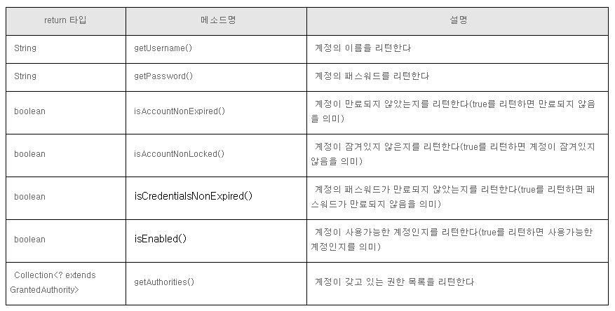

# 스프링 시큐리티
   - Jenkins, DB서버, 웹서버
   - 레이아웃
   - 공통 모듈(파일, 페이징...)
   - 관리자
1. 의존성 설치
- ID : user
- PW : 콘솔에 출력
2. 스프링 시큐티리 설정

3. 회원가입 구현
    1) UserDetails 인터페이스 : DTO

    2) UserDetailsService 인터페이스 : Service : 회원정보 조회
    3) 비밀번호 해시화 - BCrypt
       - PasswordEncoder
         - encode : 해시화
         - matches : 해시된 비밀번호와 사용자가 입력한 비밀번호의 일치 여부
         
4. 시큐리티를 이용한 회원 인증(로그인) 구현
   - successHandler : AuthenticationSuccessHandler 인터페이스
   - failureHandler : AuthenticationFailureHandler 인터페이스
   - redirectURL=주소 : 성공시 이동 페이지
   
5. 로그인 정보 가져오기
   1) Principal 요청메서드에 주입  : getName() : 아이디  : 요청 메서드의 주입
```java
@ResponseBody
@GetMapping("/info")
public void info(Principal principal) {
    String username = principal.getName();
    System.out.printf("username=%s%n", username);
```
   2) SecurityContextHolder를 통해서 가져오기
```java
@ResponseBody
@GetMapping("info")
public void info() {
    MemberInfo memberInfo = (MemberInfo) SecurityContextHolder
                                .getContext()
                                .getAuthentication()
                                .getPrincipal();

    System.out.println(memberInfo);
    }
```
   3) @AuthenticationPrincipal  : UserDetails 구현 객체 주입, 요청 메서드의 주입시 밖에 사용 가능
```java
@ResponseBody
@GetMapping("/info")
public void info(@AuthenticationPrincipal MemberInfo memberInfo) {
    System.out.println(memberInfo);
    }
```
   4) Authentication
      - Object getPrincipal(...) : UserDetails의 구현 객체
```java
MemberInfo memberInfo = (MemberInfo) authentication.getPrincipal();
Member member = memberInfo.getMember();
session.setAttribute("member", member);
```

/error 템플릿 경로 : 응답 코드.html

6. thymeleaf-extras-springsecurity6
    1) ```xmlns:sec="http://www.thymeleaf.org/extras/spring-security"```
    2) ```sec:authorize="hasAnyAuthority(...)", sec:authorize="hasAuthority(...)"```
    3) ```sec:authorize="isAuthenticated()"``` : 로그인 상태
    4) ```sec:authorize="isAnonymous()"``` : 미로그인 상태

    5) csrf 토큰 설정하기
        - ${_csrf.token}
        - ${_csrf.headerName}

7. 페이지 권한 설정하기
    - AuthenticationEntryPoint

8.  Spring Data JPA Auditing + Spring Security
- 로그인 사용자가 자동 DB 추가
1) AuditorAware 인터페이스


POST 요청시 CSRF 토큰 검증 : 검증 실패시 403
- 자바 스크립트 ajax 형태로 POST 데이터를 전송할시 CSRF 토큰 검증

User-Agent : 

모바일 장비 체크 정규표현식 패턴
".*(iPhone|iPod|iPad|BlackBerry|Android|Windows CE|LG|MOT|SAMSUNG|SonyEricsson).*"

. : 문자 1개
.. : 문자 2개
.* : .{0, }0개 이상, 최소 배치
.+ : .{1, } 최다 배치

수동전환
?device=pc -> pc뷰
?device=mobile -> Mobile뷰

/404.html
status : 응답 코드
path : URL 경로
message : 오류메세지
erorr
method
timestamp

form(양식에서는 ) GET, POST만 되는데 hidden : _method=PATCH 로 변경 할 수있다.
```java
@Bean
    public HiddenHttpMethodFilter hiddenHttpMethodFilter() {
        return  new HiddenHttpMethodFilter();
        // form에서 get,post말고 PATCH, PUT, DELETE 쓸수 있게 만들어준다.
    }
```

도메인 주도 설계 : DDD(Domain Driven Design)
MSA(Micro Service Architecture)

Domain: 전문가 영역
   - 표현 계층 : 컨트롤러
   - 서비스 계층(도메인 계층 - 기능,)
   - 인프라 계층 : 예) 데이터베이스

ModelMapper 의존성
    : 동일한 getter, setter 패턴 ->


