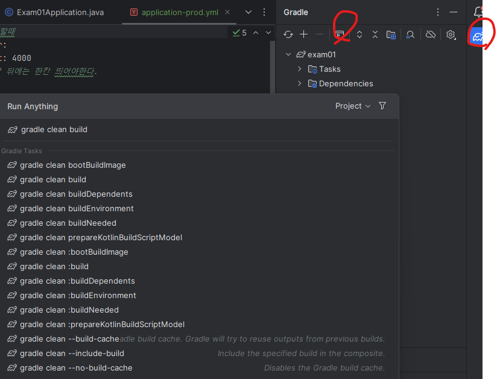
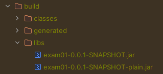

스프링 부트
1. 소개
   starter
    - 셋팅, 빌드 자동화
    - 버전 X

   - Spring boot devtool
   - 소스 변경시 - 자동 재시작
   - 템플릿 변경 - 브라우저 새로고침 자동 - 라이브 리로드 기능

2. 설정
- application.properties
- yaml, yml -> JSON : 들여쓰기
- application.yml - default : 개발할때
- application-프로필명.yml 
  - application-prod.yml : 배포할때
  - @Value ?
- 배포시
  - gradle clean build -> jar
    - (컴파일 - 테스트 - 빌드)
  - gradle bootJar - 테스트를 건너뛰고 빌드만
  
  
    - java -jar 배포파일.jar
    - java -jar -Dspring.profiles.active=프로필명 배포파일.jar
      - 설정파일 : application-프로필명.yml
    - CTRL + C = 실행 중단
  - maven clean package

Lombok : 로그 기록
- @Log
- @Log4j
- @Log4j2
- @Slf4j
  - ->log 멤버 변수 추가
    - .info(...)
    - .debug(...)
    - .trace(...)
    - .fatal(...)
    - .error(...)

3. **@Scheduled**
1) fixedDelay : 작업 완료 후 지연
2) fixedRate : 작업 시간 포함 지연
3) initialDelay : 처음만 지연
4) cron
    - */5 -> 5초마다
    - */1 -> 1시간 마다
5) **@EnableScheduling** - 스케쥴 작업 설정 자동 추가

4. Spring Data jdbc
- Spring Data
  - 엔티티 : 데이터 한개
  - CrudRepository 인터페이스
  - 쿼리 메서드
  - Pageable 인터페이스