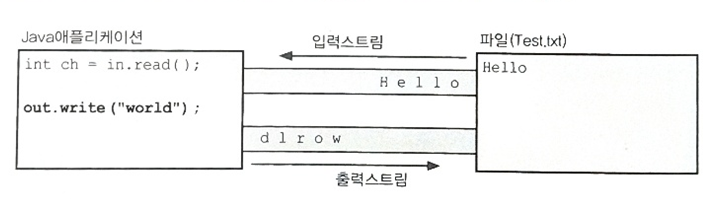

입출력(I/O)
java.io
1. 입출력이란?
    - Input/Output   입력 / 출력
    - 컴퓨터 내부 또는 외부와 프로그램간의 데이터를 주고받는 것

2. 스트림(stream)
    - 데이터가 이동하는 통로
    - 입력 통로(입력 스트림)
    - 출력 통로(출력 스트림)

바이트기반 스트림 : 데이터 크기가 바이트 단위 / 1바이트씩 읽어오는 스트림
1. 입력 스트림 - InputStream
   - 기반 스트림 : 직접 데이터에 접근하는 스트림
     - FileInputStream
     - ByteArrayInputStream
     - int read() // 1바이트, (0 ~ 255), -1 -> 바이트 보다 더 큰 자료형 필요해서 기본자료형인 int를 사용
   - 보조 스트림 : 직접 데이터에 접근 x, 다른 스트림에 추가적인 기능을 부여, 데코레이터 패턴
     - FilterInputStream의 하위 클래스
       - BufferedInputStream : 버퍼기능 추가(8kb - 기본 버퍼 사이즈)
       - DataInputStream : 기본 자료형으로 데이터 읽기 기능 부여
     - InputStreamReader(InputStream in) : 바이트 단위 읽기 스트림 - 문자 단위 스트림 변환
     - ObjectInputStream : 객체를 읽을 수 있도록 변환 기능 추가
2. 출력 스트림 - OutputStream
    - 기반 스트림 : 직접 데이터에 접근하는 스트림
      - FileOuputStream : 파일에 출력
      - ByteArrayOutputStream : 메모리에 출력
    - 보조 스트림 : 직접 데이터에 접근x, 다른 스트림에 추가적인 기능 부여, 데코에이터 패턴
      - FilterOutputStream 하위 클래스
        - BufferedOutputStream : 버퍼기능 추가(8kb - 기본값)
        - DataOutputStream : 기본 자료형을 데이터 쓰기 기능 부여
      - OutputStreamWriter(OutputStream out) : 바이트 단위 쓰기 스트림 -> 문자 단위 쓰기 스트림 변경
      - ObjectOutputSteam : 객체를 쓸 수 있도록 변환 기능 추가

문자기반 스트림 : 데이터 크기가 문자 단위(유니코드 - 2, 3 바이트)
1. 입력 스트림 - Reader
   - 기반 스트림 : FileReader, CharArrayReader, StringReader ...
   - 보조 스트림 : BufferedREader - 다른 스트림에 버퍼라는 추가 기능
2. 출력 스트림 - Writer
    - 기반 스트림 : FileWriter, CharArrayWriter, StringWriter ...
      - PrintStream, PrintWriter
    - 보조 스트림 : BufferedWriter - 다른 스트림에 버퍼라는 추가 기능

표준입출력 : 콘솔에 입력, 출력
1. System.in : InputStream : 콘솔에서 데이터를 입력 받는 스트림
2. System.out : PrintStream : 문자 단위 스트림(PrintWriter)
3. System.err : PrintStream

File

직렬화(Serialization)
- 객체에 저장된 데이터를 스트림에 쓰기(write)위해 연속적인(serial) 데이터로 변환하는 것을 말한다.
1. ObjectInputStream
2. ObjectOutputStream

참고)
InputStreamReader : 바이트 단위 입력 스트림 -> 문자 단위
	OutputStreamWriter : 바이트 단위 출력 스트림 -> 문자 단위