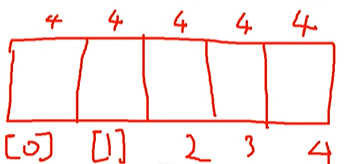

컬렉션 프레임워크
- 컬렉션(Collection) - 데이터 군집
- 프레임워크 (Framework) : 편하게 쓸수 있는 틀 제공

예) int[] nums = new int[5];

[] : 인덱스 연산자 -> 배열 특정 위치를 계산하는 연산자 
 

java.util에 들어있다.

<table>
    <tr>
        <th>인터페이스</th>
        <th>특징</th>
    </tr>
    <tr>
        <td>List</td>
        <td>
            - 순차 자료구조  
            - 순서가 유지 되는 자료
        </td>
    </tr>
    <tr>
        <td>Set</td>
        <td>
            - 집합 자료구조 
            - 중복x 
            - 순서 유지는 x
        </td>
    </tr>
    <tr>
        <td>Map</td>
        <td>
            - 사전 자료구조 
            - 키, 값의 쌍 구조 
            - 키 : 값을 찾기 위한 키워드, 중복x (Set) 
            - 값 : 중복 가능(Collection)
        </td>
    </tr>
</table>

컬렉션 프레임워크(Collections Framework)

컬렉션(Collections) - 데이터 군 -> 자료 
프레임워크(Framework) : 표준화된 설계

데이터 군을 다루는데 필요한 클래스를 표준화서 설계

java.util : 편의 기능

1. 컬렉션 프레임워크 핵심 인터페이스

Collection 인터페이스
- Iterator iterator(): 반복자 패턴 구현
  - boolean hasNext() : 다음 조회할 요소가 있는지 체크
  - E next() : 다음 요소 가져오기
1) List : 순차 자료 구조
- 순서가 있는 자료
- 값의 중복은 중요하지 X
- 배열
	- 추가 
		- add(E e) : 가장 끝에 추가
        - add(int index, E e) : index 위치에 추가
		- addAll(Collection ... ) 
		- addAll(int index, Collection ...)
		
	- 조회
		- E get(int index) : 순서 번호 요소 조회 		
		- int indexOf(E e) : e요소의 첫번째 위치 번호(왼쪽)
		- int lastIndexOf(E e) : e요소의 첫번쨰 위치 번호(오른쪽)
        - boolean contains(E e) : 요소가 포함되어 있는지 여부 
	
	- 수정 
		- set(int index, E e)
		
	- 삭제
		- E remove(int index) : 순서 번호 요소 삭제, 반환값: 삭제된 요소		
		- boolean remove(E e) 
	
	- 기타
		- int size() : 요소의 갯수

	- 구현 클래스 
		- ArrayList : 배열을 구현한 클래스	
			- 장점 : 조회 속도가 빠르다.
			- 단점 : 순서가 변경되는 변화 -> 새로운 배열이 계속 생성
					변경이 잦은 데이터는 불리하다.
			- 스택 구조 구현시 유리하다.
		- LinkedList 	
			- 장점 : 추가, 수정, 삭제가 빠르다. 순서 변경되는 변화에 유리하다.
			- 단점 : 조회 속도가 ArrayList보다는 불리하다.
			- 큐 구조 구현시 유리
				- Queue 인터페이스의 구현 클래스
					- offer(E e) : 끝에 추가
					- E poll() : 가장 앞쪽 요소를 꺼내기
		- Stack
			- push(E e) : 끝에 추가
            - E pop() : 끝에 요소를 꺼내기
		- Vector : 배열을 구현한 클래스 

- ListIterator listIterator()
  - 순방향 (hasNext(), next())
  - 역방향 (hasPrevious(), previous())
  - nextIndex(), previousIndex()
			
			
2)  Set : 집합 자료 구조	
			
- 복이 없는 자료
- 순서 유지는 중요 X
			
	- 추가
		- add(E e)
        - addAll(Collection ...)
		
	- 삭제
		- boolean remove(E e)
		
	- 기타
		- int size() : 요소의 갯수
		- boolean contains(E e)

	- 구현 클래스
		- HashSet
        - TreeSet (정렬 기능 추가)
    - 중복을 제거하려면? 객체의 동등성을 비교해 보고 이미 있는 객체이면 추가 배제
      - equals and hashcode() 값 -> 동등성 판단 기준
	- 참고) 비교 : 
  		- 동일성 
          - 같은 주소에 있는 자원
          - ==
          - int num1 = 19
          - num1 == 10
  		- 동등성
          - 같은 가치의 값을 가지고 있는가
          - equals() and hashCode()
          - Object 클래스에 정의된 기본 정의
            - equals() : 동일성 비교
            - hashCode() : 객체의 주소 값, 가상으로 부여된 주소, 유니코드, 정수 

	

3)  Map : 사전 자료 구조
    - 키 - 값의 쌍 구조

	- 키 : 중복 X (Set 자료형)
	- 값 : 중복 O (Collection 자료형)
    
추가
- put(K k, V v) 
  - 동일한 키가 등록되어 있으면 수정  
- putIfAbsent (K k, V v) 
  - 값이 등록되어 있지 않은 경우만 추가

수정
- put(K k, V v)
- replace(K k, V v)

조회
- V get (Object k)
- V getOrDefault(Object k, V defaultValue)

삭제
- remove(Object k)

구현 클래스 
- HashMap 
- TreeMap : + 키 값의 정렬

Map.Entry 인터페이스 : 키 - 값 쌍 객체
table[] 배열

2. Stack과 Queue
- Stack : 
- Queue : 대기줄, 대기열, 순서대로 나온다.

3. Iterator, ListIterator, Enumeration
- ListIterator listIterator()
	- 순방향 (hasNext(), next())
	- 역방향 (hasPrevious(), previous())
	- nextIndex(), previousIndex()
- Enumeration
  - hasElements

4. Comparator와 Comparable

기본 정렬 기준 : java.lang.Comparable
- int compareTo(T t) : Natural Order
- 현재 < 비교 대상 -> 앞에다 배치
- 현재 == 비교 대상 -> 이동 x
- 현재 > 비교 대상 -> 뒤에다 배치

대안 정렬 기준 : java.util.Comparator
- int compare(T o1, T o2)
- final 키워드 : 최종적, 마지막, 변경 불가
	1) 변수에 붙는 경우 : 상수 - 변경 불가
	2) 메서드에 붙는 경우 : 재정의 불가(상속)
	3) 클래스명 앞에 붙는 경우 : 상속 불가

java.util 패키지 
5. Arrays : 배열의 편의 기능 모음
	- List<T> asList(T... ) : 변경 불가 List (error = UnsupportedOperationException)
    - fill(배열, 값) : 값을 배열에 채워 넣기
    - equals(배열, 배열) : 배열 값 비교(재귀적)
    - deepEquals(...) : 다차원 배열 값 비교
   
    - sort(배열) : Natural Order 기준 - Comparable 구현 내용에 따른 정렬
    - sort(배열, Comparator) : 대안적인 기준(Comparator) 지정해서 정렬
   
    - toString(배열) : 배열 값을 확인 (1차원 배열)
    - deepToString(다차원 배열) : 다차원 배열의 값을 확인

	- mismatch(...) : 두 배열에서 값이 달라지는 위치에 대한 정보

6. Collections : 컬렉션의 편의 기능 모음

java.util.Objects : 객체의 편의 기능 (s가 붙으면 편의기능 ex) Arrays, Collections)
 - .Collections : 컬렉션의 편의 기능
 - .Arrays : 배열의 편의 기능
 - java.util.stream.Collectors : 데이터 수집의 편의 기능
 - 편의 기능 클래스 - 정적 메서드 위주 (static)

 

