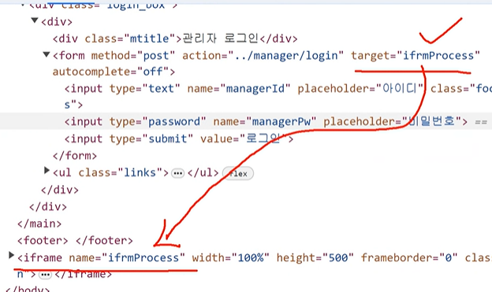

스프링 파일 업로드(MultipartFile)
1. multipart란?
   <form> 속성 : enctype="multipart/form-data"

    - multipart : 요청 헤더
        - 일반 양식 데이터의 파트
        - 파일 데이터(바이너리 데이터) 파드
        - text데이터와 file 데이터가 두개가 달라서 나눠서 표시하는거다.

   - 기본 양식 content-type
       - application/x-www-form-urlencoded
2. web.xml 설정
```xml
   <multipart-config>
      <max-file-size>20971520</max-file-size> <!--  1MB * 20 --> // 한번에 보내는 파일 용량 제한
      <max-request-size>41943040</max-request-size> <!-- 40MB -->
   </multipart-config>
```
1kb - 1024 byte
1mb - 1024 kbyte

3. MultipartFile 인터페이스

4. addResourceHandlers 설정
    - 파일 업로드 경로 -> 서버 접근 URL로 연결
    - 올린 파일을 웹에서 보려고 자원 조회

프로필
1. @Profile
   - profile에 따라서 생성되는 빈의 종류를 달리 할 수 있는 방식
   - 빈을 분리해서 사용

2. spring.profiles.active
```xml
        <init-param>
            <param-name>spring.profiles.active</param-name>
            <param-value>dev</param-value>
        </init-param>
```
1) web.xml
2) 배포 파일 실행시
   java -jar -Dspring.profiles.active=프로필이름

프로퍼티 파일을 이용한 프로퍼티 설정

1. @Configuration
   public static PropertySourcesPlaceholderConfigurer properties() {
   PropertySourcesPlaceholderConfigurer configurer = new PropertySourcesPlaceholderConfigurer();
   configurer.setLocations(
   new ClassPathResource("db.properties"),
   new ClassPathResource("info.properties"));
   return configurer;
   }

- PropertySources : 설정파일에서 가져온다.
- PlaceholderConfigurer : 교체하는 설정 방식


2. @Value("${프로퍼티 키값}") : 문자열만 주입
```java
public class DbConfig {
    @Value("${db.username}")
    private String username;
    @Value("${db.password}")
    private String password;

    @Bean(destroyMethod = "close")
    public DataSource dataSource() {
        DataSource ds = new DataSource();
        /* 연결 설정 */
        ds.setDriverClassName("oracle.jdbc.driver.OracleDriver");
        ds.setUrl("jdbc:oracle:thin:@localhost:1521:orcl");
        ds.setUsername(username);
        ds.setPassword(password);
    }
}
```

@ConfigurationProperties

파일 업로드 기능 구현
1. 파일 삭제
2. 파일 다운로드 : 응답시 출력 방향 -> 파일
- 응답 헤더 : Content-Disposition : attachment : filename = 파일명
- Content-Disposition : 콘텐츠가 브라우저 내부에 보여질 것인지, 아니면 다운로드돼서 로컬에 저장될 것인지를 알려주는 헤더
  - Content-Disposition: inline
  - Content-Disposition: attachment
  - Content-Disposition: attachment; filename="filename.jpg"
3. 자바스크립트 공통 모듈
   - 파일 업로드
   - 파일 다운로드
	
Ajax(Asynchronous Javascript and XML)
: 페이지 새로고침 없이(변경 없이) 데이터 치환 기술, 페이지 이동없이 요청 응답값을 가져온다.

XMLHttpRequest 생성자
- open("요청방식", "요청주소")
- send(body 데이터) : 요청 body 데이터 전송
- body 데이터 : POST, PUT, PATCH<br>
   GET방식일때는 null


  데이터

1. 게시판 설정 : 설정1 -> 게시판 1개
2. 게시글 데이터

target : 이동할 창
- self : 현재 창 (기본값)
- blank : 새창

iframe : 문서를 정의하는 브라우저의
<br>
iframeProcess로 이동


페이징
- 구간별 시작 번호 : 페이지 구간 번호(0,1,2,...) * 페이지 구간별 갯수 + 1
- 구간별 마지막 번호 : 구간별 시작 번호 + 페이지 구간별 갯수 -1